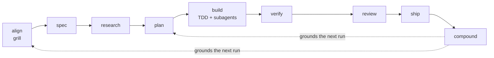

# Devflow architecture

Devflow is a **compounding development loop** for AI coding agents: a set of
composable skills, build and review personas, and slash commands that carry a change from
intent to shipped — and fold what you learn back into the next change. This
document is the design: the principles, the loop, the layers, and why it's shaped
this way.

## Design principles

1. **Process, not prose.** Every skill is a workflow with steps, checkpoints, and
   exit criteria — not advice an agent skims. (from agent-skills / superpowers)
2. **Evidence over vibes.** Nothing is "done" without proof: a green suite, a
   clean build, runtime data, or an artifact at a known path.
3. **Durable, rewindable artifacts.** Each phase writes a file under
   `docs/devflow/`. Context lives on disk, survives compaction, and can be rewound.
   (from PAW)
4. **Compounding.** Solved problems become `solutions/` notes that ground the next
   run. The loop gets smarter each cycle. (from compound-engineering)
5. **Right-sized ceremony.** A one-line fix and a multi-week feature take
   different paths — hence dual on-ramps.
6. **Composable and one-directional.** Small skills compose; orchestration flows
   one way (commands → user-invoked skills → model-invoked skills → personas), so
   nothing loops back on itself. (from mattpocock)
7. **Portable.** One SKILL.md-first source runs on Copilot, Claude, Cursor, Codex,
   and more.
8. **Small core, specialist edge.** Keep the lifecycle coherent; discover a
   pinned, audited specialist only when a phase has a concrete capability gap.
9. **Outcome-first, resumable execution.** Plan backward from observable behavior
   and critical connections; prove untested boundaries before expanding. Fresh
   task packets and reconciled checkpoints preserve context without making
   summaries substitutes for evidence. (from [GSD Core](gsd-core.md))

## The loop



The return arrow from **compound** is the whole point: `compound-learnings` writes
knowledge that `align-and-grill`, `plan-in-phases`, and `research-codebase` read
as grounding next time.

## Two on-ramps (dual entry)

Devflow right-sizes itself to the work:

- **Greenfield / feature — `feature-workflow` (`/df-feature`)**
  `align → spec★ → research → plan★ → build → verify → review → ship★ → compound`.
  Full ceremony, human approval at the ★ milestones.

- **Brownfield / bug — `fix-workflow` (`/df-fix`)**
  `reproduce & root-cause → failing repro test → fix at root → verify → review →
  ship★ → compound`. Enters at debugging; shares every underlying skill; less
  ceremony, same discipline.

- **Autonomous — `autopilot` (`/df-auto`)**
  Given an approved spec (or confirmed bug), collapses build→PR into one hands-off
  run after a single approval, stopping only for blockers or irreversible steps.

A small, well-understood change skips the orchestrators and invokes a single phase
skill directly. The `using-devflow` router picks the on-ramp.

## Three layers

Devflow separates three concerns so they compose cleanly:

| Layer | Location | Role | Rule |
| --- | --- | --- | --- |
| **Skills** | `skills/<name>/SKILL.md` | The *how* — workflows with exit criteria | Model-invoked; orchestrators are user-invoked |
| **Agents / personas** | `agents/<role>.md` | The *who* — a perspective + output format | A persona never invokes another persona |
| **Commands** | `.claude/commands`, `commands`, `.github/prompts` | The *when* — user entry points | The orchestrator; one per skill entry point |

`software-engineer` is the only persona that writes code; the other five review
what it produces.

The one endorsed multi-persona pattern is **parallel fan-out with a merge**:
`review-code` runs `spec-auditor` and `code-reviewer` concurrently on independent
axes, then synthesizes one verdict. No persona "routers".

### Invocation axes

- **Model-invoked skills** (most of them) auto-activate when their `description`
  triggers match — the reusable discipline.
- **User-invoked skills** (`feature-workflow`, `fix-workflow`, `autopilot`) set
  `disable-model-invocation: true`; they orchestrate and are reached only via a
  `/df-*` command. A user-invoked skill may call model-invoked skills, never
  another user-invoked one.

### Conditional capability hook

Phase skills may invoke `awesome-copilot-discovery` when they can name expertise
missing from the local catalog. The bridge searches only
`github/awesome-copilot`, pins one candidate to a commit SHA, stages it
temporarily, verifies its inventory and blob digests, and audits it before manual
review. The accepted contribution remains below the current phase in the
authority chain; it cannot become a new orchestrator, grant tools, or bypass a
gate. Downloaded code is never executed and the staged copy is removed at phase
end.

## Artifacts

Every durable artifact lives under `docs/devflow/` in the project that *uses*
Devflow (templates in [`/templates`](../templates), contract in
[artifacts.md](artifacts.md)):

```
docs/devflow/
  <slug>/ spec.md · research.md · plan.md   ← per unit of work
          notes.md (optional)              ← bounded execution checkpoint
  solutions/*.md                            ← the compounding knowledge base
  CONTEXT.md                                ← shared language / domain model
  adr/*.md                                  ← architecture decisions
```

Because artifacts are plain files in git, **rewind** is just reverting to an
earlier artifact and re-running from that phase.

GSD Core is the seventh source pillar, not a fourth architectural layer. Its
milestone/phase/plan/task machinery is consolidated into the existing unit of
work and plan tasks. `plan.md` holds proof, dependency contracts, coverage, and
phase closures; optional `notes.md` points to current work and pending gates.
`context-engineering` reconciles those records with the repository on resume.
The [shared execution contract](../references/execution-checkpoints.md) adds no
runtime, command, persona, or mandatory artifact tree.

## The skill catalog by phase

- **Meta:** `using-devflow` (router), `awesome-copilot-discovery`,
  `writing-devflow-skills`
- **Align/Define:** `align-and-grill`, `idea-refine`, `write-spec`, `domain-modeling`
- **Research:** `research-codebase`, `source-grounded-research`
- **Plan:** `plan-in-phases`
- **Build:** `subagent-driven-implementation`, `incremental-implementation`,
  `test-driven-development`, `api-and-interface-design`, `frontend-ui-engineering`,
  `context-engineering`
- **Verify:** `verify-before-done`, `debug-root-cause`, `browser-verification`
- **Review:** `review-code`, `simplify-code`, `security-hardening`,
  `performance-optimization`
- **Ship:** `git-workflow`, `ship-it`, `resolve-pr-feedback`
- **Compound:** `compound-learnings`
- **Orchestrators:** `feature-workflow`, `fix-workflow`, `autopilot`

Full descriptions: [skills catalog](../skills/README.md).

## Anti-rationalization as a first-class mechanism

Agents default to the shortest path — skipping specs, tests, and reviews. Every
Devflow skill carries a **Common Rationalizations** table (the excuse + the
rebuttal) and **Red Flags** (observable "you're off-track" signs). This makes the
discipline self-correcting rather than dependent on the agent's goodwill.

## Extending Devflow

Add or edit skills via `writing-devflow-skills`, following
[skill-anatomy.md](skill-anatomy.md). Prefer extending an existing skill over
adding a near-duplicate. Keep skills minimal, composable, and evidence-based.
